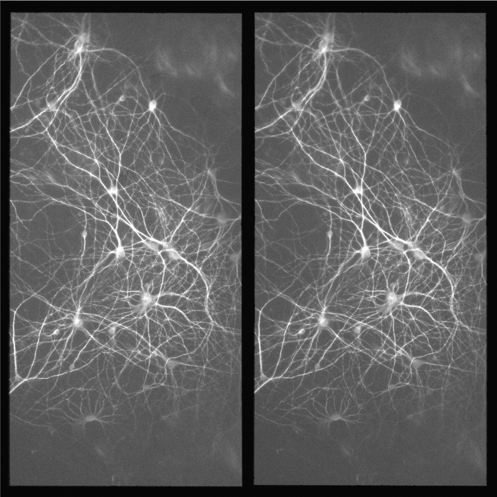
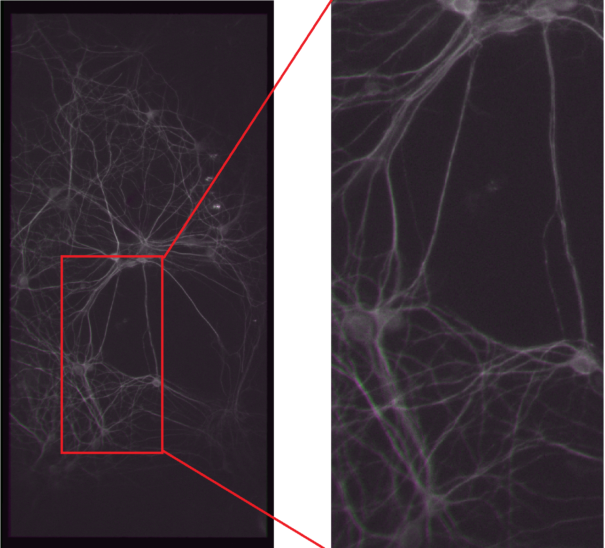
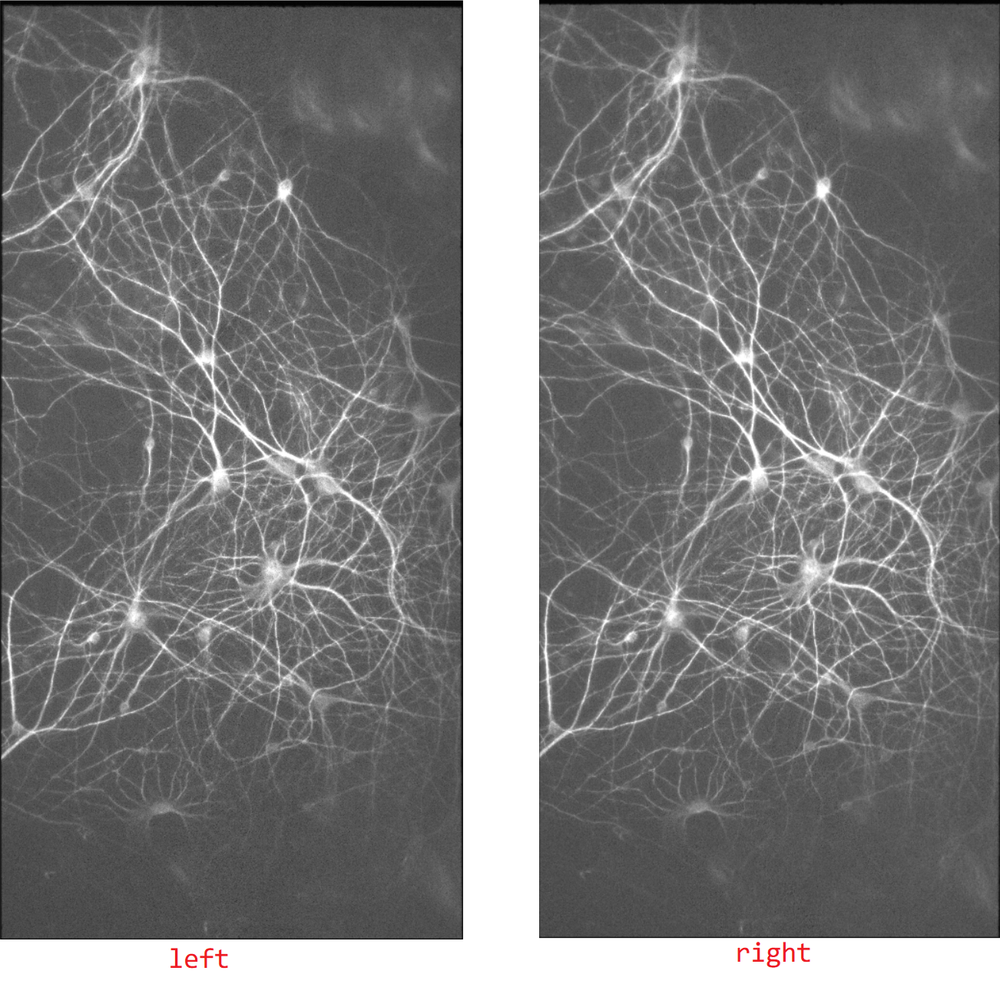

# Image Registration and Splitting
Using different methods to realize image registration and splitting

Author: Zhang Zhihong

Email: z_zhi_hong@163.com

## Demo

original image: containing 2 sub-images, side by side 

registration result: imshowpair, falsecolor

splitting result: left and right

## Structure of directories

| directory |      description      |
| :-------: | :-------------------: |
|   test    |    original files     |
|   tform   | transformation matrix |
|  result   |   splitting results   |
|   demo    |     demo results      |

## Usage

- Main code: image_registration_n_splitting.m
  - the left sub-image is used as reference (fixed) image, and the right image is registered according to the left image
  - registration and splitting can be carried out subsequently or separately (set the DO_REGISTER, and DO_SPLITTING in the codes). 
  - Generally, we have images acquired from the same device,  which means they have the same transformation matrix. so we just need to do one time registration with one original image and get the transformation matrix, and for the other images,  we just need to do the splitting. In fact, the code is just organized in this way.
  - ROI is enabled when in splitting
- registration methods
  - 'built-in': use build-in functions ('imregconfig', 'imregtform') to calculate transformation matrix, and then do the transformation to get the registered image  (or directly use 'imregister' to get registered image)
  - 'build-in-finetune': use build-in functions ('imregconfig', 'imregtform', 'imregister') to calculate transformation matrix, and do the transformation to get rough registration. Then use it  as initial transformation to fine tune the result. It's time-consuming
  - 'point-pairs': use manually selected point pairs to calculate the transformation matrix, and then do the transformation to get the registered image.

## Notes

- In 'build-in' and 'build-in-finetune' modes, if the spatial scaling of your images differs by more than 10%, resize them with [`imresize`](https://www.mathworks.com/help/images/ref/imresize.html) before registering them **——cautious!**
- Both [`imregtform`](https://www.mathworks.com/help/images/ref/imregtform.html) and `imregister` use the same underlying registration algorithm, but the former output the geometric transformation that relates `moving` to `fixed`, the latter directly output the registered result
- the code can be easily adjust to different types of original unregistered images, just change the the reference and unregistered images, i.e., 'fixed' and 'moving' images in the code according to your own data